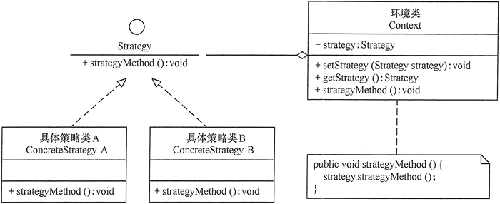

## 策略模式
####策略模式的使用场景
策略模式：该模式定义了一系列算法，并将每个算法封装起来，使它们可以相互替换，且算法的变化不会影响使用算法的客户。策略模式属于对象行为模式，它通过对算法进行封装，把使用算法的责任和算法的实现分割开来，并委派给不同的对象对这些算法进行管理。

优点：
* 策略模式可以提供相同行为的不同实现，客户可以根据不同时间或空间要求选择不同的。
* 策略模式提供了对开闭原则的完美支持，可以在不修改原代码的情况下，灵活增加新算法。
* 策略模式把算法的使用放到环境类中，而算法的实现移到具体策略类中，实现了二者的分离。
* 避免了大量的if...else，switch...case。
* 策略模式提供了一系列的可供重用的算法族，恰当使用继承可以把算法族的公共代码转移到父类里面，从而避免重复的代码。

确定：
* 策略模式会维护很多的策略类，增加了维护难度。

####策略模式的结构
策略模式是准备一组算法，并将这组算法封装到一系列的策略类里面，作为一个抽象策略类的子类。策略模式的重心不是如何实现算法，而是如何组织这些算法，从而让程序结构更加灵活，具有更好的维护性和扩展性

1. 结构
策略模式由三个角色构成：
* 抽象策略类：定义了一个公共接口，各种不同的算法以不同的方式实现这个接口，环境角色使用这个接口调用不同的算法，一般使用接口或抽象类实现。
* 具体策略实现类：实现了抽象策略定义的接口，提供具体的算法实现。
* 环境类：持有一个策略类的引用，最终给客户端调用。

